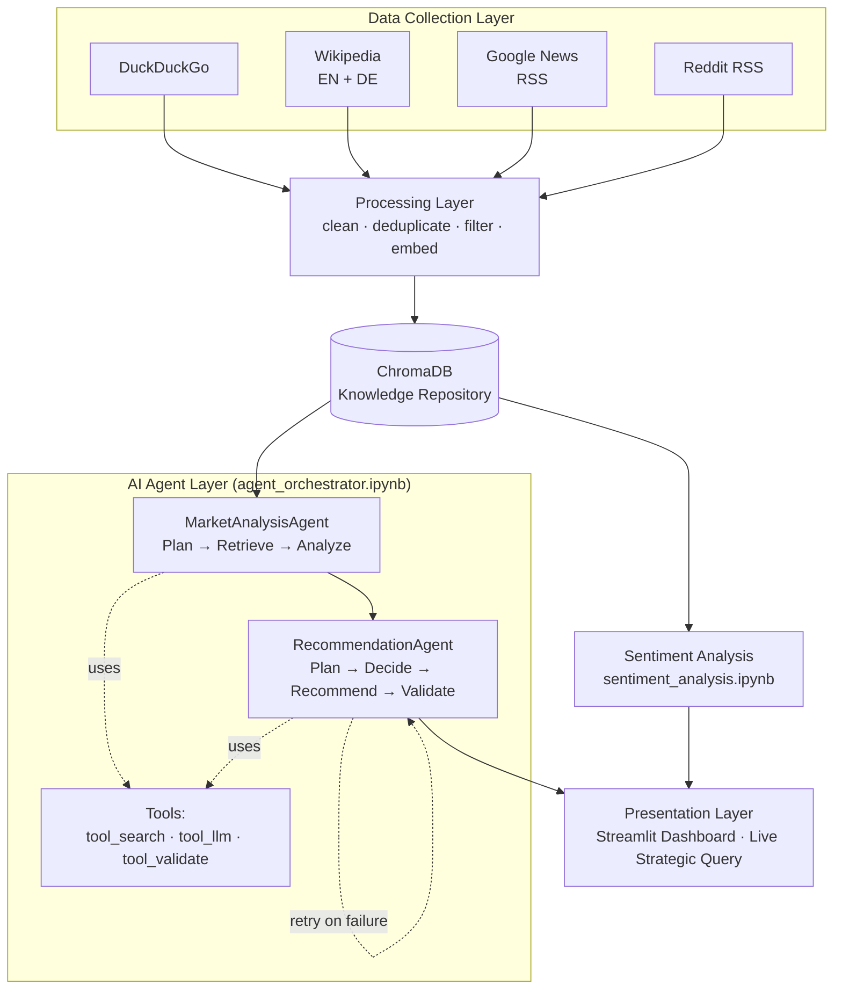
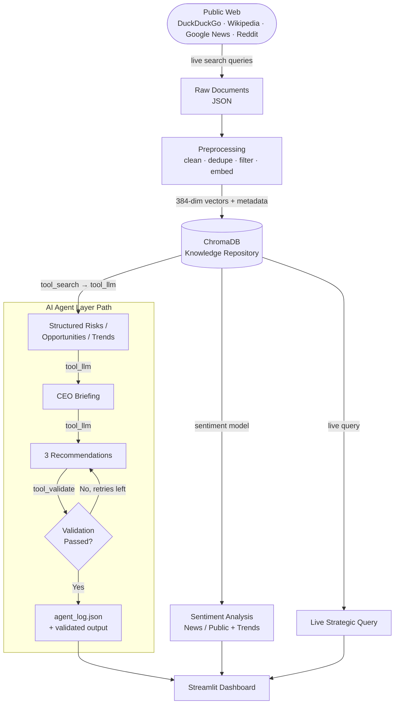

# Lufthansa Strategic Intelligence Agent

An AI-powered Strategic Intelligence Agent built for Lufthansa Group. The system automatically collects live information about the company from the public web, stores and organizes it for semantic search, identifies opportunities, risks, and trends, and reasons like a CEO advisor to produce evidence-based strategic recommendations — all presented through an interactive executive dashboard.

The goal of this project is not information retrieval or summarization. The goal is **strategic decision-making**: the system is designed to answer the question *"If you were the CEO today, what would you do next and why?"*

---

## Table of Contents

- [Introduction](#introduction)
- [System Architecture Diagram](#system-architecture-diagram)
- [Data Flow Diagram](#data-flow-diagram)
- [Technology Stack](#technology-stack)
- [AI Pipeline](#ai-pipeline)
- [AI Agent Layer](#ai-agent-layer)
- [Design Decisions](#design-decisions)
- [Project Structure](#project-structure)
- [How to Run](#how-to-run)

---

## Introduction

Organizations today are surrounded by a continuous flow of information — news, financial reports, competitor activity, customer feedback, and industry trends. The challenge is no longer *finding* information; it is *transforming* it into strategic decisions.

This project builds an AI Strategic Intelligence Agent for Lufthansa Group that:

1. **Collects** live, real information about Lufthansa from multiple independent public sources, in both English and German
2. **Cleans and filters** the data to keep only relevant, deduplicated content
3. **Stores** that information in a searchable knowledge repository
4. **Identifies** opportunities, risks, and trends using Retrieval-Augmented Generation (RAG)
5. **Reasons** like a CEO advisor — prioritizing actions, justifying decisions, and explicitly addressing trade-offs
6. **Produces** evidence-based recommendations with expected impact and risk assessment
7. **Analyzes sentiment** across news and public/community sources
8. **Demonstrates explicit AI agent behaviour** — planning, tool use, retrieval, analysis, autonomous decision-making, and validation — through a dedicated agent layer built on top of the pipeline above
9. **Presents** everything through an interactive Streamlit dashboard, including a live query feature

---

## System Architecture Diagram



**Local reasoning engine:** All LLM-based reasoning (AI Agent Layer, Live Query) runs locally via Ollama using **Llama 3.1 8B**, chosen for its official multilingual support (including German) and more consistent JSON-formatted output under repeated testing. This is fully open-source and satisfies the project requirement that the reasoning engine must not be a paid commercial LLM API.

---

## Data Flow Diagram



---

## Technology Stack

| Layer | Component | Choice | Reason |
|---|---|---|---|
| Collection | Web search | DuckDuckGo (`ddgs`) | Free, no API key, doesn't block automated requests (unlike Google or direct site scraping) |
| Collection | Encyclopedic data | `wikipediaapi` (English + German) | Structured background on Lufthansa Group and its subsidiaries |
| Collection | News | Google News RSS (targeted queries) | Free, live, Lufthansa-specific results |
| Collection | Community | Reddit RSS (`r/lufthansa`) | Genuine community discussion, verified relevant |
| Storage | Knowledge repository | ChromaDB | Stores text, embeddings, and metadata together; built-in persistence and similarity search |
| Storage | Embedding model | `paraphrase-multilingual-MiniLM-L12-v2` | Multilingual (English + German), lightweight, 384-dimension vectors |
| Storage | Similarity metric | Cosine similarity | Measures meaning (vector direction), unaffected by document length |
| Intelligence | Reasoning LLM | Llama 3.1 8B via Ollama (local) | Open-source, official multilingual (EN/DE) support, satisfies "no paid commercial API" requirement, more consistent structured JSON output than smaller models tested |
| Intelligence | Sentiment model | `cardiffnlp/twitter-xlm-roberta-base-sentiment` | Multilingual, 3-class (positive/negative/neutral), empirically tested as most accurate on business/news text |
| Agent Layer | Orchestration | Plain Python (classes + functions) | Explicit, dependency-free control flow that keeps every agent decision inspectable and explainable |
| Agent Layer | Tools | `tool_search`, `tool_llm`, `tool_validate` | Explicit, named capabilities the agents call — satisfies "tool usage beyond the LLM itself" rather than one black-box LLM call |
| Agent Layer | Validation | Rule-based Python checks (not LLM) | Deterministic pass/fail on evidence count and rating values, independent of model randomness |
| Presentation | Dashboard | Streamlit | Fast to build, interactive widgets, suitable for live demo |
| Presentation | Visualization | Matplotlib + Plotly | Static charts for simple comparisons, interactive charts for trend exploration |

---

## AI Pipeline

The system follows a **Retrieval-Augmented Generation (RAG)** pattern for all reasoning tasks:

```
Retrieval  →  Semantic search in ChromaDB finds the most relevant documents
              for a given question, using cosine similarity over multilingual embeddings

Generation →  The retrieved documents are passed to the local LLM (Llama 3.1 8B),
              which reasons over them and generates new, evidence-grounded text —
              risks, opportunities, trends, recommendations, or a live answer
```

This pattern is applied four times across the project:

1. **Strategic Intelligence Engine** — retrieves documents per sub-topic (e.g. competitive threats, regulatory changes) and generates structured risks/opportunities/trends with severity/impact and confidence scores
2. **AI CEO Agent** — takes the intelligence output and generates prioritized strategic recommendations, explicitly reasoning about trade-offs between competing priorities
3. **Evidence-Based Recommendations** — reformats the CEO's priorities into the exact structured format (Recommendation / Supporting Evidence / Expected Impact / Risk Assessment)
4. **Live Strategic Query** — answers any new question, live, using the same retrieval-then-generation pattern, demonstrating the working prototype on demand

**Sentiment Analysis** is deliberately *not* part of the RAG pipeline — it retrieves documents but only classifies them (positive/negative/neutral); no new text is generated, so it does not qualify as RAG.

---

## AI Agent Layer

### Why this exists

The pipeline described above demonstrates RAG (retrieval-augmented generation), but on its own follows the pattern:

> User → Prompt → LLM + RAG (via Ollama) → Response

This demonstrates successful use of a Large Language Model, but does not demonstrate explicit AI agent behaviour. Following clarified assignment requirements, the system was extended — without discarding the existing pipeline above — to add:

- Planning before execution
- Tool usage beyond the LLM itself
- Retrieval and use of evidence
- Analysis of risks, opportunities, and trends
- Autonomous decision-making
- Validation of recommendations before presenting them

### Architecture

`notebooks/agent_orchestrator.ipynb` implements two specialized agents, coordinated by an orchestrator function:

```
Goal
  → MarketAnalysisAgent   (Plan → Retrieve → Analyze)
  → RecommendationAgent   (Plan → Decide → Recommend → Validate)
```

**`MarketAnalysisAgent`** plans its retrieval strategy, calls `tool_search` (semantic search over ChromaDB) separately for risks, opportunities, and trends, then calls `tool_llm` to extract structured findings from the retrieved evidence.

**`RecommendationAgent`** plans its prioritization approach, calls `tool_llm` to synthesize a CEO executive briefing, calls `tool_llm` again to generate exactly 3 structured recommendations, then calls `tool_validate` — a rule-based, non-LLM check — to verify the output before presenting it.

### Tools

Three explicit tools, satisfying "tool usage beyond the LLM itself":

| Tool | What it does |
|---|---|
| `tool_search` | Semantic search over the ChromaDB knowledge repository |
| `tool_llm` | The Ollama LLM call — one capability among several, not the entire system |
| `tool_validate` | Deterministic Python rule-checking, independent of the LLM |

### Autonomous decision-making

After validation, `RecommendationAgent` decides:

- Validation passes → present recommendations as final
- Validation fails, retries remain → retry with the specific validation failures fed back as corrective feedback (up to 2 retries)
- Retries exhausted → flag the output for review rather than presenting it as correct

This was demonstrated live during testing: an initial run scored 0/3 on validation; after one retry with the specific failures fed back as corrective feedback, the same run reached 3/3. Each agent run is logged to `data/agent_log.json` (goal, both agents' plans, validation report, retry count, final status) as an auditable record of this behaviour.

---

## Design Decisions

**Why DuckDuckGo over Google or direct site scraping**
Google actively blocks automated search requests, and a direct attempt to scrape Lufthansa's own website returned a 403 Forbidden error. DuckDuckGo's `ddgs` library is purpose-built for automated search and does not block this kind of access.

**Why both English and German sources**
Lufthansa is a German company. A meaningful share of its richest content — financial reports, competitive analysis, regulatory and union matters — is published in German first or only in German. Using German search queries and German Wikipedia surfaces content that an English-only collection would miss entirely.

**Why a multilingual embedding model instead of the brief's recommended English-only models**
The brief recommends `BAAI bge-base-en-v1.5`, `BAAI bge-small-en-v1.5`, and `all-MiniLM-L6-v2` — all explicitly English-only models (note the `-en-` in two of the names). Since the collected data is a genuine mix of English and German, an English-only model would fail to properly represent the meaning of German documents during semantic search. `paraphrase-multilingual-MiniLM-L12-v2` was chosen as the natural multilingual variant of the same MiniLM family the brief recommends, preserving the spirit of the recommendation while correctly handling the actual data.

**Why cosine similarity over Euclidean distance**
Collected documents vary enormously in length — from short titles to full Wikipedia extracts. Euclidean distance is sensitive to vector magnitude, which is influenced by document length, and would incorrectly treat longer documents as "further away" even when they share the same meaning. Cosine similarity measures only the angle between vectors, ignoring length, making it the correct choice for a corpus with highly variable document lengths.

**Why a local LLM (Ollama) instead of a cloud API**
The brief explicitly disallows OpenAI, Anthropic, Gemini, and any paid commercial LLM API as the reasoning engine. Llama 3.1 8B, run locally via Ollama, is fully open-source and satisfies this requirement without ambiguity. It was chosen over an initially-used smaller model (Phi-4 Mini) after testing showed more reliable structured JSON output and official documented support for German, matching the project's bilingual corpus.

**Why filtering for relevance happens after collection, not instead of broad collection**
RSS feeds from general aviation sources return many articles unrelated to Lufthansa specifically (e.g., about other airlines). Rather than relying on narrow collection alone, documents are collected broadly and then explicitly filtered by checking for mentions of Lufthansa or its subsidiaries — ensuring the final knowledge base is genuinely focused on the company being analyzed.

**Why the CEO Agent must address trade-offs explicitly**
A flat, unranked list of opportunities is information retrieval, not strategy. The CEO Agent's prompt explicitly requires it to state what is being *deprioritized* and *why* the top choice is more urgent than the alternatives — reflecting the reality that Lufthansa, like any organization, has limited resources and cannot pursue every opportunity at once.

**Why the dashboard reads pre-computed results rather than calling the LLM live for every section**
LLM inference on local hardware can be slow and is sensitive to available memory. Pre-computing the Strategic Intelligence Engine, CEO Agent, and Evidence-Based Recommendations ahead of time, then having the dashboard simply read and display the saved results, ensures the dashboard loads quickly and reliably. The separate **Live Strategic Query** feature demonstrates the same underlying retrieval-and-reasoning pipeline working in real time, on demand, without compromising the reliability of the core dashboard sections.

**Why two agents instead of one**
Splitting responsibility into `MarketAnalysisAgent` and `RecommendationAgent` matches the project clarification's explicit phrasing — an agent for market analysis and an agent for recommendation — and keeps each agent's responsibility narrow enough to reason about and debug independently, rather than one large general-purpose agent.

**Why plain Python over LangChain or LangGraph**
LangChain's `AgentExecutor` lets the LLM choose tool call order at runtime, which is harder to guarantee follows the required Goal→Plan→Retrieve→Analyze→Decide→Recommend→Validate sequence. LangGraph offers explicit state graphs, a reasonable technical fit, but introduces new syntax (typed state, conditional edges) not required by the brief. Plain Python classes and functions keep every decision in the agent's control flow explicit and explainable, with no added dependency.

**Why validation is rule-based, not LLM-based**
An LLM checking its own or another LLM's output is still text generation, not verification — it offers no guarantee of catching real formatting errors. `tool_validate` uses deterministic Python rules (exact evidence count, valid rating values) so that a given output always produces the same pass/fail result, independent of model randomness.

---

## Project Structure

\`\`\`
lufthansa_intelligence/
├── notebooks/
│   ├── data_collection.ipynb        # Task 1: Live data collection
│   ├── processing.ipynb             # Task 2 + 3: Knowledge repository + processing
│   ├── sentiment_analysis.ipynb     # Sentiment Analysis
│   └── agent_orchestrator.ipynb     # AI Agent Layer: MarketAnalysisAgent + RecommendationAgent
├── data/                            # Saved outputs (documents, intelligence, sentiment, recommendations, agent_log.json)
├── storage/
│   └── chromadb/                    # Persistent vector database
├── assets/                          # Dashboard images
├── app.py                           # Streamlit Executive Intelligence Dashboard
├── requirements.txt
├── .env                             # API keys (not committed to GitHub)
└── README.md
\`\`\`

---

## How to Run

1. Clone the repository and create a virtual environment
2. Install dependencies: `pip install -r requirements.txt`
3. Install and start [Ollama](https://ollama.com), then pull the model: `ollama pull llama3.1:8b`
4. Add a HuggingFace token to a `.env` file: `HF_TOKEN=your_token_here`
5. Run the notebooks in order — `data_collection` → `processing` → `intelligence_engine` → `sentiment_analysis` → `ceo_agent` → `recommendations` — to collect data, build the knowledge repository, and generate intelligence outputs, **or** run `agent_orchestrator.ipynb` alone to regenerate the same outputs through the explicit AI agent layer
6. Launch the dashboard: `streamlit run app.py`
